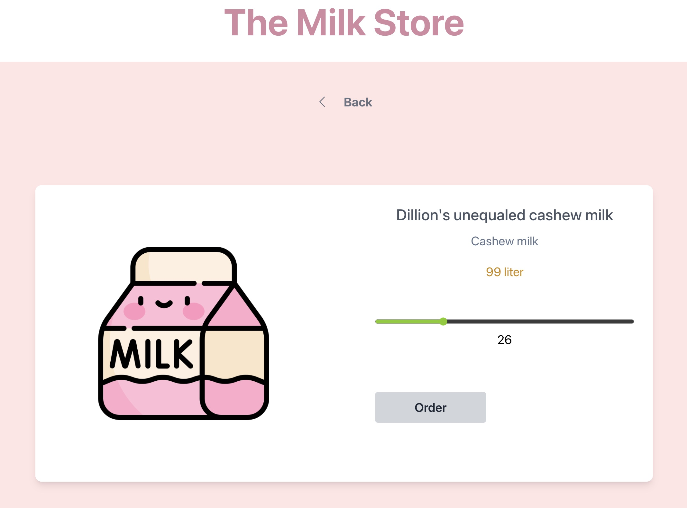

# This is an application for a Milk Store

## Tech stacks utilized are:

- React(Vite)
- Typescript
- TailwindCss

## The app will list all available milk products via backend api (Asp.Net/SQL)

## User can filter to display by type of milk

## User can search word by product name or product type

## User can click to a product detail page and order

### Project Requirements

- As the customer enters the site they should be met with all the cards of milk that are in storage
- A search bar where they can search based on name
- A filter function that can filter out different types of milk;
- The customer should be able to click on a card and be redirected to the product

  1.  Info should be displayed
  2.  A slider, or an number input, to choose how much liter they want to order
  3.  An order button. When this is clicked it should be clear that the order is done and the storage should be updated

### Optional

- Pagination; There are 99 products, so to divide the products to pages could be good
- A cart; maybe the customer wants many different types of products. So a cart and checkout page could be useful!
- Deploy your application!
